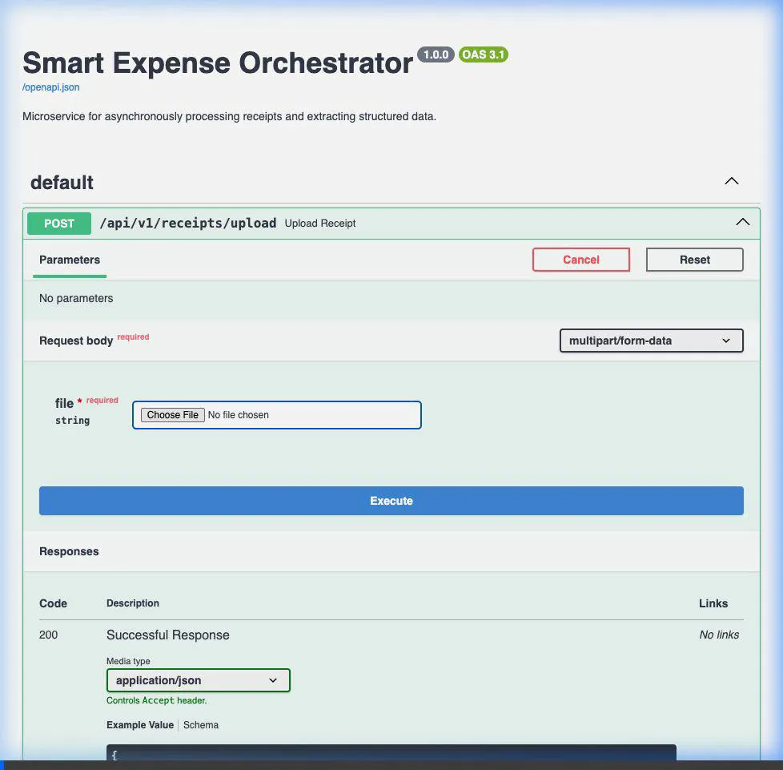

# Smart Expense Orchestrator

A high-performance backend microservice designed to asynchronously process receipt uploads and extract structured financial data using OpenAI's GPT-4o.

[Read the Full Architecture Case Study](./case_study.md)
### Live Demo


## Problem and Approach

**The Problem:** Extracting structured financial data (merchants, line items, taxes) from raw receipt images is traditionally error-prone and requires complex OCR pipelines. While LLMs (like GPT-4o) excel at this, their API calls are slow and can easily bottleneck a synchronous web server.

**The Approach:** This microservice treats receipt processing as an asynchronous workflow. 
- **Decoupled Ingestion:** Uploads immediately return a `task_id`, handing off the heavy LLM processing to a background worker.
- **Background Processing:** Celery and Redis manage the task queue, ensuring concurrent execution and resilience against failures.
- **Schema-Constrained Extraction:** GPT-4o's structured output mode is utilized, backed by strict Pydantic validation to guarantee the database only receives clean, typed data.
- **Non-blocking I/O:** The entire database layer uses `asyncpg` and SQLAlchemy 2.0, allowing the FastAPI web workers to maintain high throughput.

## Tech Stack
- **Python 3.11+**
- **FastAPI**
- **PostgreSQL** (SQLAlchemy & Alembic)
- **Redis** & **Celery**
- **OpenAI API**
- **Docker Compose**

## Quick Start

### 1. Configuration
Create your environment file:
```bash
cp .env.example .env
```
Open `.env` and configure your `OPENAI_API_KEY`.

### 2. Run the Application
The easiest way to interact with the project is via the provided `Makefile`.

Spin up all services (Web, Worker, DB, Redis):
```bash
make up
```

### 3. Run Database Migrations
Generate and apply the initial database schema (if not already applied):
```bash
make migrate m="initial_migration"
make upgrade
```

### 4. API Usage

#### Upload a Receipt
```bash
curl -X POST -F "file=@/path/to/receipt.jpg" http://localhost:8000/api/v1/receipts/upload
```
**Response:**
```json
{
  "task_id": "abc-123",
  "status": "PENDING",
  "message": "Receipt uploaded and queued for processing"
}
```

#### Check Status & Fetch Data
```bash
curl http://localhost:8000/api/v1/receipts/abc-123
```
**Response:** *(Once Processed)*
```json
{
  "id": 1,
  "task_id": "abc-123",
  "status": "COMPLETED",
  "merchant_name": "Example Store",
  "total_amount": 42.50,
  "tax_amount": 3.10,
  "currency": "USD",
  "line_items": [
    {
      "id": 1,
      "description": "Coffee",
      "quantity": 1.0,
      "unit_price": 4.50
    }
  ]
}
```

## Developer Tools

Run linting (Ruff + MyPy):
```bash
make lint
```

Format code:
```bash
make format
```

Run tests:
```bash
make test
```

Tear down services:
```bash
make down
```

## Notes and Trade-offs

- **Cost vs. Latency:** GPT-4o provides excellent extraction accuracy but at a higher token cost and latency compared to traditional OCR. For scale, routing simpler receipts to a faster, cheaper model could be implemented.
- **State Management:** Currently, polling (`GET /receipts/{task_id}`) is required to fetch the final result. For a truly real-time client experience, implementing WebSockets or Server-Sent Events (SSE) would reduce unnecessary polling traffic.
- **Storage:** Receipt images are encoded and sent directly to OpenAI. A production deployment would likely need an object storage layer (like AWS S3) to persist the raw images for auditing, debugging, or human-in-the-loop review.
